.. Text uebernommen von
   https://io.informatik.fh-augsburg.de/cgi-bin/trac_Logikanalysator.cgi
   
   https://io.informatik.fh-augsburg.de/cgi-bin/trac_Logikanalysator.cgi/wiki/TitleIndex


   H. Hoegl, 2014-12-07  


.. inhalt::
.. sectnum::


Systemarchitektur
=================

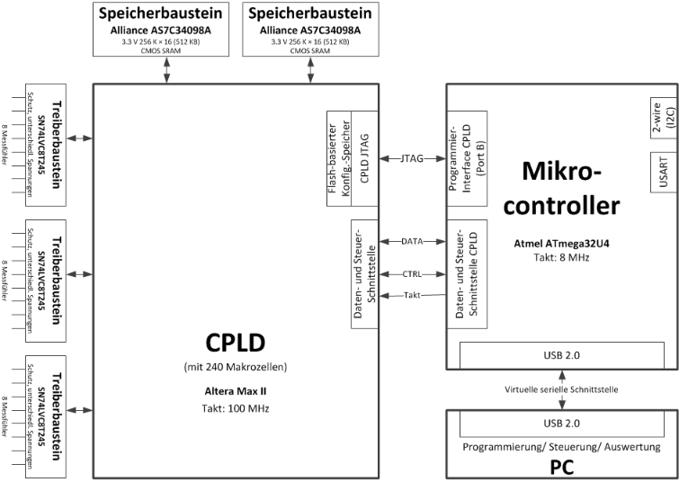


top_level
=========


.. https://io.informatik.fh-augsburg.de/cgi-bin/trac_Logikanalysator.cgi/wiki/CpldImplToplevel


Hier sind alle Komponenten des CPLD für den Logikanalysator enthalten. 

.. figure:: top_level.png
   :scale: 20%
   :target: top_level.png

Folgende Module sind enthalten:

(Alles Links)

- mega_control
- ram_control
- measure_control
- manager
- status_register 

mega_control
------------

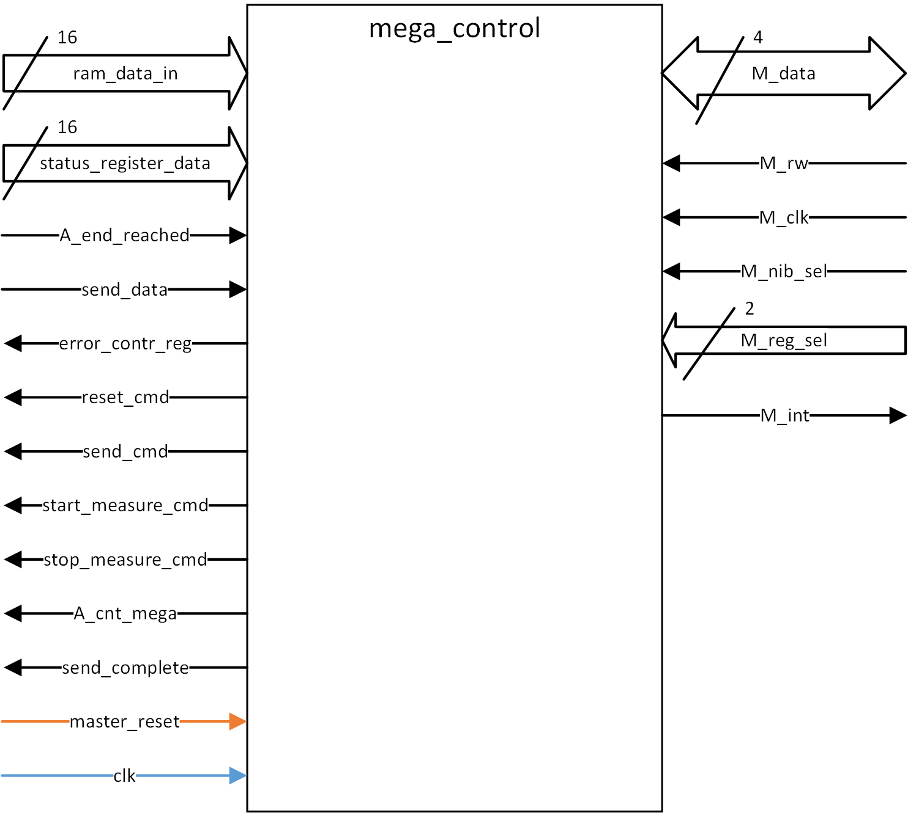

Beschreibung zu Mega-Control:

Das Modul mega_control ist für die Kommunikation des CPLD mit dem
Mikrocontroller zuständig. Hier wird die Datenrichtung der bidirektionalen
Datenleitungen zwischen CPLD und Mikrocontroller entsprechend der Steuersignale
des uC festgelegt. Die empfangenen Kommandos werden intern von control_register
ausgewertet und entsprechende Steuersignale erzeugt. 

.. figure:: mega_control_overview.jpg

Folgende Sub-Module sind darin enthalten:

- send_control
- receive_control
- mega_tristate_driver
- control_register 

send_control
````````````

.. figure:: send_control.png

send_control

Wenn Daten vom Mikrocontroller angefragt wurden, ist das Modul send_control
dafür zuständig, dass die gewünschten Informationen an dem 4-Bit breiten
bidirektionalen Datenbus M_data vom CPLD ausgegeben werden. Der Automat wird
aktiv sobald vom Mikrocontroller der Lesebefehl (Befehl mit Bitmuster XXXX0110
) empfangen wurde. Dann wird das Eingangssignal send_data vom manager
aktiviert. Zusätzlich muss am Pin M_rw ein Low-Pegel anliegen, da ein Senden
der Daten erst dann Sinn macht wenn die Gegenstelle so signalisiert, dass diese
bereit zum Empfangen ist. Außerdem beeinflusst der Pegel an M_rw den
mega_tristate_driver, der die Datenrichtung des Datenbus M_data festlegt. 

Auswahl der Daten

Das Modul send_control kann Daten, die aus dem RAM ausgelesen wurden, oder den Inhalt des Statusregisters senden. Beide Quellen haben eine Signalbreite von 16 Bit. Der Datenbus zum Mikrocontroller hat allerdings nur 4 Bit. Deshalb muss jedes Datenwort in vier Nibble aufgeteilt werden, die nacheinander gesendet werden. Der Mikrocontroller kann an den Leitungen M_reg_sel (2 Bit) und M_nib_sel (1 Bit) auswählen, welches Nibble er als nächstes haben will. Bei der nächsten steigenden Flanke von M_clk werden die logischen Pegel des aktuell ausgewählten Nibble an den Datenbus M_data angelegt und bleiben dort erhalten bis zur nächsten steigenden Flanke von M_clk.

Codierung Register-Select: 

::

   Codierung   Register 	                Bits
   00 	       Unteres Byte Daten-Register 	0-7
   01 	       Oberes Byte Daten-Register 	8-15
   10 	       Unteres Byte Status-Register 	0-7
   11 	       Oberes Byte Status-Register 	8-15 

Die Reihenfolge, in der die einzelnen Nibble abgefragt werden, sollte sein:

 1.     Unteres Byte, unteres Nibble (M_reg_sel = X0, M_nib_sel = 0)
 2.     Unteres Byte, oberes Nibble (M_reg_sel = X0, M_nib_sel = 1)
 3.     Oberes Byte, unteres Nibble (M_reg_sel = X1, M_nib_sel = 0)
 4.     Oberes Byte, oberes Nibble (M_reg_sel = X1, M_nib_sel = 1) 

Dieser Ablauf gilt für das Auslesen des RAM (X = 0) und des Statusregisters (X
= 1). Der zweite Entwurf des Automaten ist zwar nicht mehr fest an diese
Reihenfolge gebunden, sie sollte aber trotzdem eingehalten werden. Nach dem
Senden des letzten Nibble der RAM Daten (M_reg_sel = 01, M_nib_sel = 1) wird
der Adresszähler des RAM um eins erhöht. So stehen bei der folgenden Abfrage
die nächsten 16 Bit aus dem Speicher zur Verfügung. 

.. figure:: send_control.png

Das Modul send_control besteht aus einem Datenpfad, in dem ein Nibble aus den
jeweils 16 Bit breiten Daten aus RAM und Satusregister mit Multiplexern
ausgewählt wird, und einem Kontrollpfad, in dem die Ansteuerung des Datenpfades
erfolgt. 

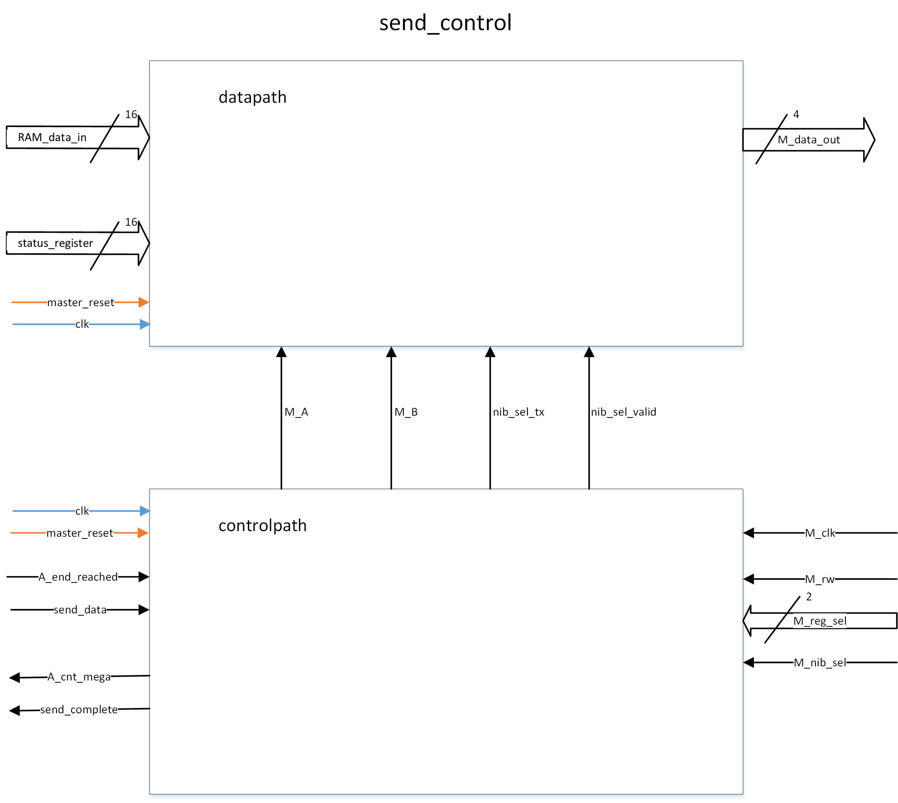

Datenpfad

Im Datenpfad wird das nächste zu sendende Nibble aus Statusregister bzw. RAM
ausgewählt und auf Anforderung auf den Datanbus M_data zum Mikrocontroller
gelegt. Die Auswahl des Nibbles erfolgt über mehrere hintereinander geschaltete
Multiplexer, die über Signale aus dem Kontrollpfad angesteuert werden. Das
ausgewählte Nibble wird nicht direkt auf den Datanbus gelegt. Um ein synchrones
Verhalten zu gewährleisten, wird der Zustand am Datenbus über ein Register
gepuffert. Erst wenn aus dem Kontrollpfad das Signal nib_sel_valid einen
High-Pegel hat, werden die am Register anliegenden logischen Pegel auf den
Datenbus übertragen. Die Werte am Ausgang des Registers bleiben erhalten, bis
nib_sel_valid das nächste mal wieder einen High-Pegel hat. 

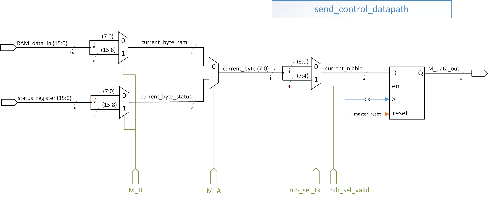

Die Simulation des Implementierten Datenpfades erfolgte in Modelsim. Hier wurde
in der Testbench an dem Eingang RAM_data_in ein fester Wert von 0xABCD und an
den Eingang status_register ein Wert von 0x1234 angelegt. Dann wurden die
Steuerleitungen M_A, M_B, nib_sel und nib_sel_valid mit unterschiedlichen
Werten stimuliert und überprüft, ob am Ausgang das richtige Nibble anliegt. 

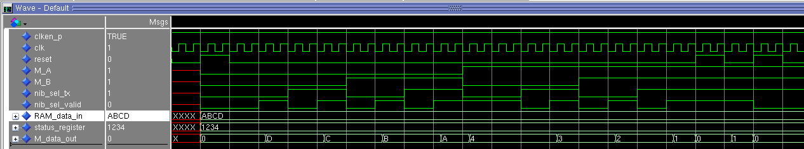


Kontrollpfad

Im Kontrollpfad befindet sich ein Zustandsautomat, der die Steuersignale des
Mikrocontrollers (M_clk, M_reg_sel, M_nib_sel, M_rw) auswertet und den
Datenpfad entsprechend ansteuert. Wenn der RAM ausgelesen wird und das letzte
Nibble der aktuellen Daten aus dem RAM ausgegeben wurde, wird der Adresszähler
des Speichers inkrementiert. So liegen bei der nächsten Abfrage schon die neuen
Daten zur Abholung bereit.

Erster Versuch

Der erste Entwurf unseres Automaten ging von einer festen Reihenfolge aus, in
der die einzelnen Nibble abgefragt werden. Die Abfrage eines flaschen Nibble
(Reihenfolge nicht eingehalten) hätte die Ausgabe eines Fehler-Signals zur
Folge. Es wurde nur der Automat für das Auslesen des RAM in einem
Zustandsdiagramm entworfen; der Teil für das Auslesen des Steuerregisters
sollte noch folgen. Da der Ablauf für das Steuerregister dem dem Ablauf für den
RAM sehr ähnelt (die Steuersignale zu Datenpfad sind nicht ganz identisch) wäre
der Automat also fast doppelt so groß geworden. 

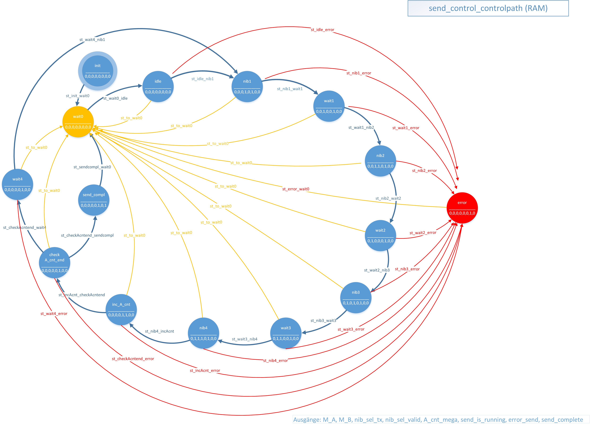

Die Bedingungen der Zustandsübergänge: 

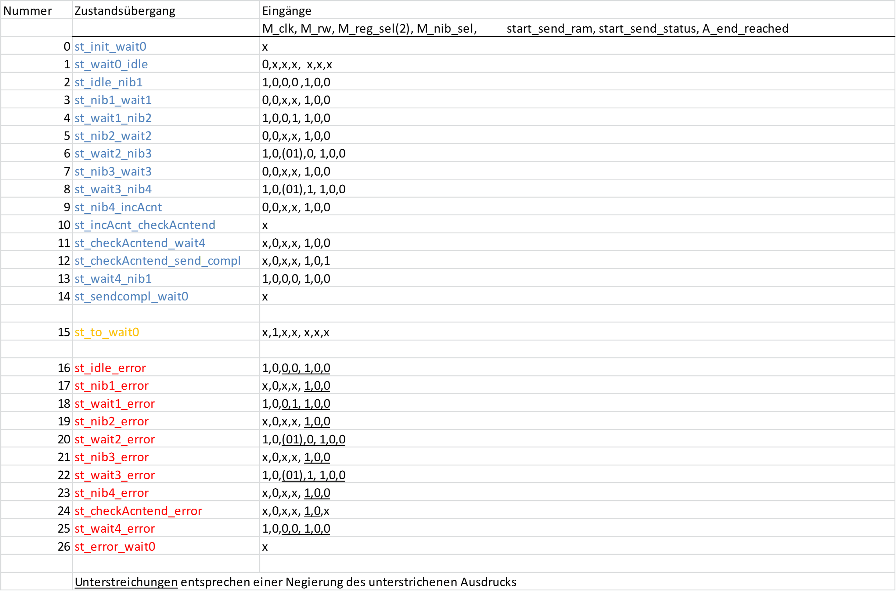

Das Modul send_control wurde mit dem "halben" Steuerautomat in Quartus
synthetisiert. Der Bedarf an Logikelementen wäre bei ungefähr 70 gewesen (Der
auf der vorhandenen Hardware befindliche CPLD hat 240 Logikelemente). Wegen
des hohen Bedarfs an Logikelementen und der Komplexität des Automaten wurde
ein neuer Zustandsautomat entworfen.

Aktuelle Version

Der erste Entwurf des Automaten ging von einer festen Reihenfolge aus, in der
die Nibble abgefragt werden. Für jedes Nibble wurden jeweils meherere Zustände
benötigt. Im aktuellen Entwurf werden die Steuerleitungen zum Datenpfad (M_A,
M_B, nib_sel_tx) direkt angesteuert von den Steuersignalen des Mikrocontrollers
(M_reg_sel, M_nib_sel). Dadurch ist es nicht mehr nötig, mehrere Zustände für
jedes einzelne abgefragte Nibble haben zu müssen. Der Automat überprüft,
welches Nibble bei steigender Flanke von M_clk abgefragt wurde. Wenn das letzte
Nibble des Statusregisters (M_reg_sel=11, M_nib_sel=1) abgefragt wurde, wird
anschließend das Senden beendet. Wenn das letzte Nibble des RAM (M_reg_sel=01,
M_nib_sel=1) abgefragt wurde, wird anschließend der Adresszähler des RAM
inkrementiert. Wurde dann die letzte Adresse des RAM (signalisiert durch das
Signal A_end_reached) erreicht, wird anschließend das Senden beendet. Da die
Reihenfolge, in der die Nibble abgefragt werden, nicht mehr überprüft wird, ist
ein Fehlerzustand nicht mehr nötig, was den Automaten weiter vereinfacht. 

.. figure:: send_control_controlpath.png


receive_control
```````````````

.. figure:: Receive_Data_and_Control_Path.png


Daten, die über den 4-Bit breiten bidirektionalen Datenbus M_data vom
Mikrocontroller kommen, werden von receive_control zu einem 8-Bit breiten
Befehlsbyte zusammengebaut und zur weiteren Auswertung an control_register
weitergereicht. Das Modul ist immer dann aktiv, wenn an M_rw ein high-Pegel
anliegt.

Die vom Mikrocontroller kommenden Steuerleitungen M_reg_sel werden von
receive_control nicht verwendet. Über M_nib_sel legt der Mikrocontroller fest,
ob die gerade am Datenbus M_data anliegenden Daten das erste (M_nib_sel = 0)
oder das zweite (M_nib_sel = 1) Nibble des Befehlsbytes ist. Die Daten der
einzelnen Nibbles werden im Datenpfad von receive_control gepuffert, bis das
letzte (das zweite) Nibble empfangen wurde. Anschließend wird dem
control_register mit reg_data_valid signalisiert, dass ein komplettes
Datenbyte empfangen wurde und nun analysiert werden kann.

Das letzte (das zweite) Nibble wird nicht durch einen Zähler, sondern durch den
logischen Pegel an M_nib_sel erkannt. Deshalb ist es wichtig, die Reihenfolge,
in der die einzelnen Nibbles vom Mikrocontroller gesendet werden einzuhalten:

1. Unteres Nibble (M_nib_sel = 0)
2. Oberes Nibble (M_nib_sel = 1) 

.. figure:: Receive_Data_and_Control_Path.png

Das Modul receive_control besteht aus einem Datenpfad, in dem die einzelnen
Nibble zu einem Befehlsbyte zusammengefügt werden, und einem Kontrollpfad, in
dem die Ansteuerung des Datenpfades erfolgt. 

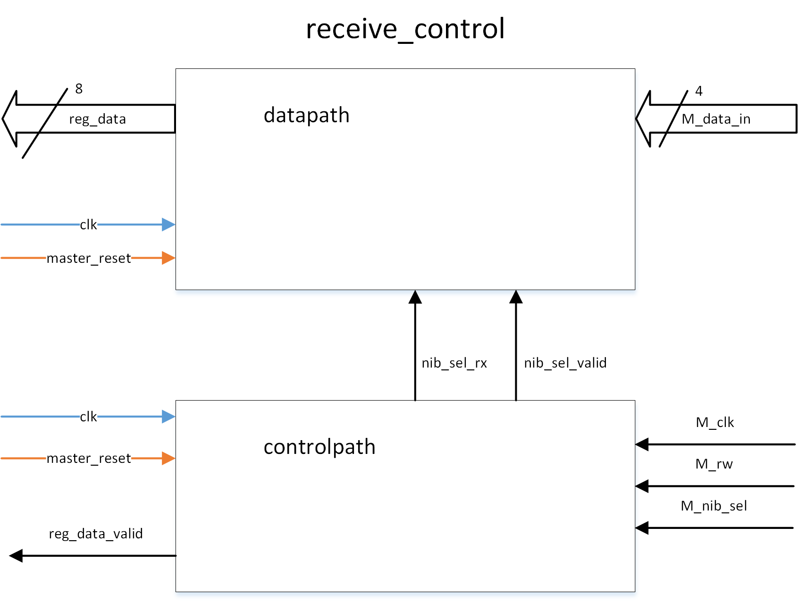

Datenpfad

Im Datenpfad werden die einzelnen empfangenen Nibbles jeweils in einem eigenen
4-Bit Register gespeichert, sobald der Kontrollpfad signalisiert, dass das
aktuell an M_data_in anliegende Nibble gültig ist (nib_sel_valid = 1). Die
Auswahl des zu aktivierenden Registers erfolgt über nib_sel_tx. Die Kombination
aus den Ausgängen der einzelnen Nibble-Register ergibt den 8-Bit breiten
Datenausgang reg_data. 

.. figure:: receive_control_datapath.png

Kontrollpfad

Im Kontrollpfad befindet sich ein Zustandsautomat, der die Steuersignale des
Mikrocontrollers (M_clk, M_nib_sel, M_rw) auswertet und den Datenpfad
entsprechend ansteuert. Wenn M_rw einen low-Perel hat, befindet sich der
Automat im Idle-Zustand. Bei einer steigenden Flanke von M_clk wird dem
Datenpfad mit nib_sel_valid signalisiert, dass die aktuell am M_data_in
anliegenden Daten gültig sind. Wurde zu diesem Zeitpunkt das zweite Nibble des
Befehlsbytes übertragen, wird davon ausgegangen, dass nun alle Daten empfangen
wurden. Dies wird dem control_register durch reg_data_valid angezeigt. 

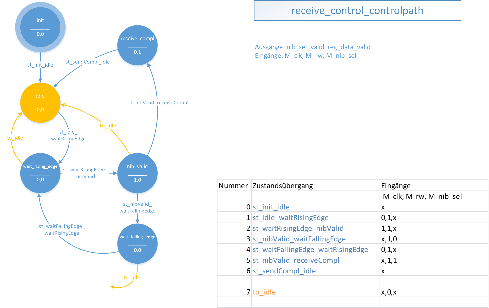


mega_tristate_driver
````````````````````

Eine konkrete Version der generischen Komponente generic_tristate_driver. 

.. figure:: Tristate_Driver_MControl.png

Die Breite der Datenleitungen ist 4 Bit, da es vier bidirektionale
Datenleitungen zwischen CPLD und Mikrocontroller gibt. 


**generic_tristate_driver**

Zur Realisierung der bidirektionalen Datenleitungen bei der Schnittstelle
zwischen CPLD und Mikrocontroller bzw. CPLD und externem Speicher wird ein
Tristate-Treiber benötigt. Dieser muss dafür sorgen, dass jeder Pin an den
Datenleitungen als hochohmiger Eingang agiert, wenn die Gegenstelle Daten auf
den Bus legen will. Sollen Daten gesendet werden, müssen die entsprechenden
Signale auf die Datenleitungen gelegt werden. Somit wird vermieden, dass ein
Kurzschluss entsteht. (Beispiel: Gegenstelle legt einen HIGH-Pegel an die
gleiche Leitung an, an der bereits durch den eigenen Baustein ein LOW-Pegel
ist.) 

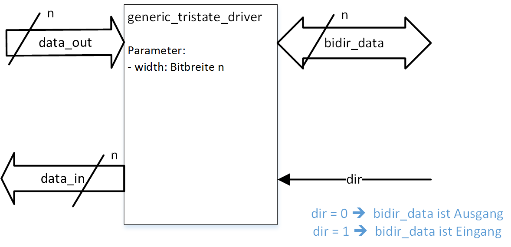

Der bidirektionale Bus bidir_data wird später mit den Pins der Datenleitungen
verbunden. Die Daten, die vom Bus in den CPLD kommen, liegen am Ausgang
data_in. Die Daten, die vom CPLD auf den Bus gelegt werden sollen, werden über
den Eingang data_out eingespeist. Die Datenrichtung der bidirektionalen Pins
wird über den Steuereingang dir festgelegt. 

::

  dir 	Datenrichtung
  0 	CPLD ---> uC / Speicher
  1 	CPLD <--- uC / Speicher 

In der Entity des implementierten generic_tristate_driver gibt es einen
generic-Parameter, über den die Bitbreite des Treibers eingestellt werden kann.
Somit muss kein eigener Treiber für jede Bitbreite neu erstellt werden. 

Simulation

Die erstellte Architektur des generic_tristate_driver wurde mit Modelsim in der
Testbench tb_tristate_driver.vhdl simuliert und getestet. Es wurde überprüft,
ob die richtigen Daten auf dem bidirektionalen Bus sowie auf dem Eingang und
Ausgang anliegen. Auch ein Konflikt, bei dem beide Gegenstellen Daten auf den
Bus legen, konnte so erzeugt werden. Die von der Gegenstelle angelegten Pegel
auf die bidirektionale Leitung werden durch den Vektor mega_data repräsentiert.
Nachdem dir auf Low-Pegel gewechselt hat, wird die Datenrichtung sofort auf
Schreiben (aus Sicht des CPLD) umgestellt und die zu sendenden "1001" werden an
den Bus angelegt. Da in der Simulation die Gegenstelle gleichzeitig "1010"
sendet, kommt es hier zu einem Konflikt in den beiden unteren Bits. 

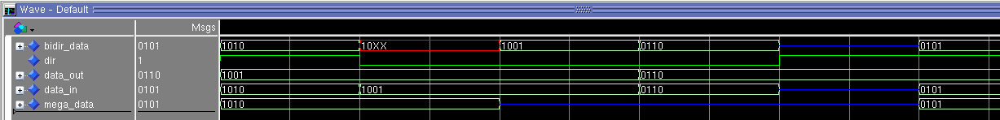

Test auf der Hardware

Da die Simulation keine Fehler ergab, wurde ein generic_tristate_driver mit
einer Bitbreite von 4 auf das CPLD-Evaluationsboard übertragen. Um alle Signale
messen zu können, sind auch die eigentlich nur für interne Verarbeitung
gedachten Signale von data_out und data_in nach außen an die Pins geführt. 

.. figure:: messaufbau.gif

Mit einem Logikanalysator konnte so das Timingverhalten des
generic_tristate_driver ermittelt werden. Die Signale D0...D3 zeigen das Signal
auf den bidirektionalen Leitungen (bidir_data), D4...D7 sind M_data_in,
D8...D11 zeigen data_out und D12 (rot) ist das Signal dir. Die eingehenden
Daten (wenn dir dies signalisiert) auf bidir_data sind "0000". Die vom CPLD zu
sendenden Daten auf data_out sind "1100". 

Fallende Flanke auf dir

Zu Beginn hat dir einen HIGH-Pegel. Das bedeutet, dass der CPLD im Lesemodus
ist. Auf bidir_data liegen die von der Gegenstelle gesendeten "0000" an. Somit
liegen diese auch an data_in an. Nachdem dir auf LOW-Pegel umgeschaltet worden
ist, liegen die vom CPLD zu sendenden "1100" von data_out auch nach einer
gewissen Verzögerung auf bidir_data an. 

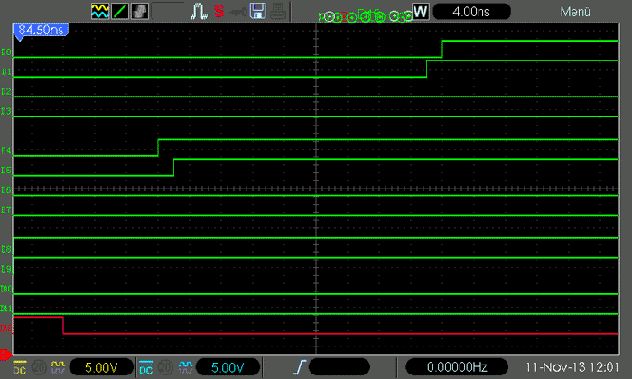

Steigende Flanke auf dir

Zu Beginn hat dir einen LOW-Pegel. Das bedeutet, dass der CPLD im Schreibmodus
ist. Auf bidir_data liegen die vom CPLD gesendeten "1100" an. Somit liegen
diese auch an data_in an. Nachdem dir auf HIGH-Pegel umgeschaltet worden ist,
liegen die von der Gegenstelle gesendeten "0000" auch nach einer gewissen
Verzögerung auf bidir_data an. 

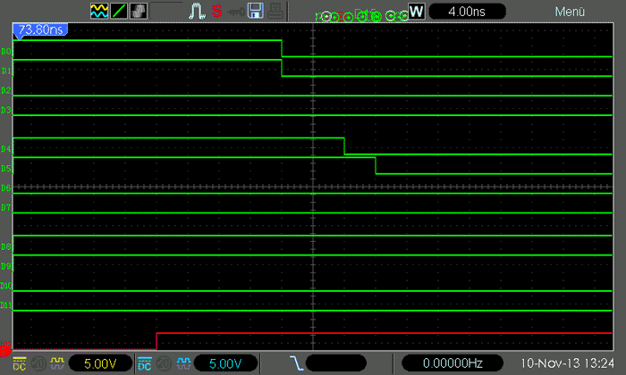


control_register
````````````````

.. figure:: Control_Register.png

Im control_register werden die 8 Bit breiten Befehle, die receive_control vom
Mikrocontroller empfängt, ausgewertet und daraus die entsprechenden Signale
erzeugt. Die Daten, die an reg_data anliegen, werden übernommen, wenn
reg_data_valid einen high-Pegel hat.

Die Ausgangssignale werden durch einen Vergleich mit vorgegebenen Bitmustern
erzeugt. Diese Bitmuster wurden festgelegt in InterfacePC-uC-CPLD: 

::

  Codierung 	Beschreibung 	        aktives Ausgangssignal
  xxxx0100 	Messung starten 	start_measure_cmd
  xxxx0101 	Messung stoppen 	stop_measure_cmd
  xxxx0110 	Auslesen der Daten starten 	send_cmd
  xxxx0111 	Reset 	reset_cmd
  xxxx0000 	Dummy-Byte 	-
  sonst 	Kein gültiger Befehl 	error_contr_reg 


XXX to do:

- https://io.informatik.fh-augsburg.de/cgi-bin/trac_Logikanalysator.cgi/wiki/InterfacePC-uC-CPLD

  "Dieser Artikel behandelt die verschiedenen Use Cases im Umgang mit dem
  Logikanalysator. Daraus ergeben sich Schnittstellen: PC<->uC und uC<->CPLD.
  Aus den Use Cases abgeleitet wird das Protokoll zur Übertragung der Daten
  zwischen PC und uC."

- https://io.informatik.fh-augsburg.de/cgi-bin/trac_Logikanalysator.cgi/wiki/InterfacePC-uC-API


ram_control
-----------

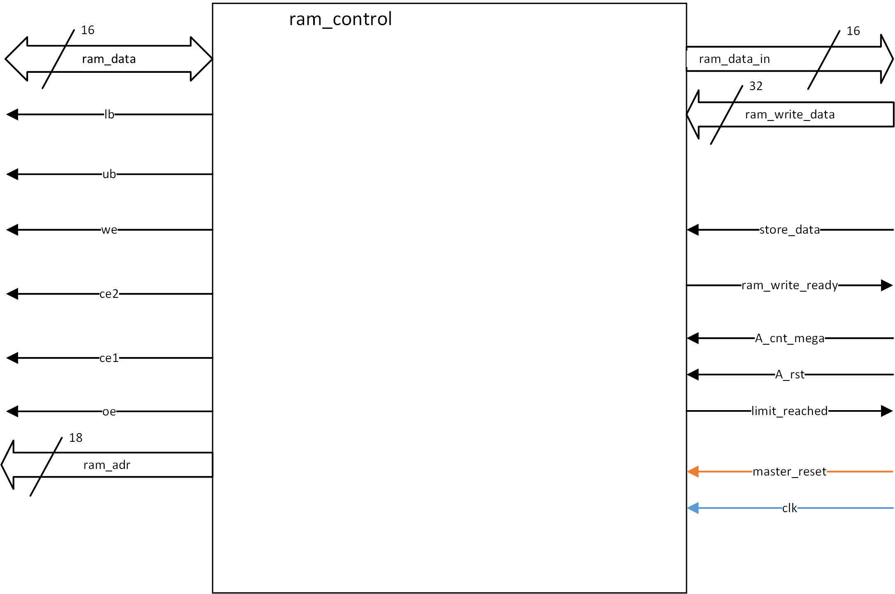

Beschreibung zu Ram_Control:

Das Modul ram_control übernimmt die Ansteuerung der externen RAM-Bausteine.
Hier wird die Datenrichtung der bidirektionalen Datenleitungen zwischen CPLD
und RAM festgelegt und der Speicher entsprechend angesteuert. Auch der
Adresszähler für die Adressierung der zu lesenden/schreibenden Speicherzelle
des RAM befindet sich hier. Die vom RAM ausgelesenenen Daten werden nicht
weiter verarbeitet und verlassen das Modul. Wenn ein Mess-Datensatz zum
Schreiben in den Speicher vorhanden ist, wird dieser in 16-Bit große Teilen
aufgeteilt, welche dann nacheinander in den RAM geschrieben werden.

Folgende Sub-Module sind enthalten:

- ram_write_control
- A_counter (Adresszähler mit Überlaufschutz)
- ram_tristate_driver 

Mit einem Multiplexer wird festgelegt, ob das Modul mega_control oder
ram_write_control dem Adresszähler den Befehl geben kann, hoch zu zählen. Wenn
ram_write_control signalisiert, dass gerade Daten an den RAM gesendet werden,
kann mega_control nicht den Adresszähler ansteuern.

Der Ausgang **we** kann den RAM in einen Lesemodus bringen; der Ausgang oe kann
den RAM in einen Schreibmodus bringen. Die beiden RAM-Bausteine können jeweils
einzeln angesteuert werden mit ce1 bzw. ce2. Mit den Signalen lb und ub können
die unteren und/oder die oberen 8 Bit des 16-Bit breiten Datenbus aktiviert
werden. Es sollen sowohl die unteren als auch die oberen 8 Bit aktiv sein.
Deshalb wird an lb und ub fest ein LOW-Pegel angelegt, da alle Steuerleitungen
zum RAM low-aktiv sind. 

ram_write_control
`````````````````

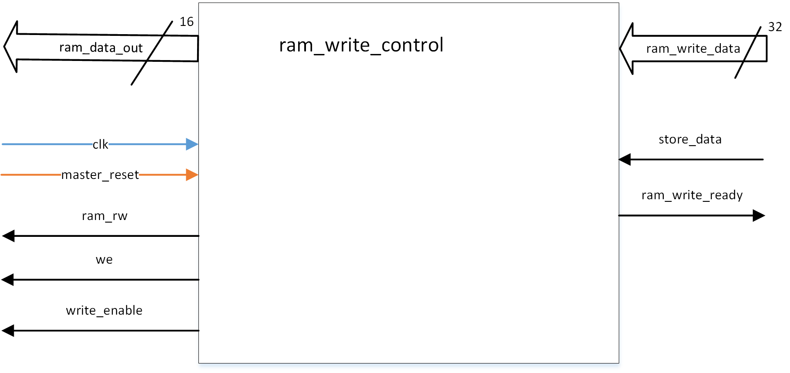

Mess-Datensatz des measure_control, der aus Messdaten, Zeitstempel und
Status-Byte besteht, in den RAM zu schreiben. Dazu müssen die 32 Bit breiten
Daten in zwei 16 Bit breite Blöcke aufgeteilt werden, die dann nacheinander in
den Speicher geschreiben werden. Die Datenrichtung auf der bidirektionalen
Datenverbindung zwischen CPLD und RAM wird festgelegt durch das
RAM-Steuersignal we und den Richtungs-Eingang des ram_tristate_driver, der sich
im ram_control befindet. 

Das Modul ram_write_control besteht aus einem Datenpfad, in dem aus den 32 Bit
Eingangsdaten die gerade benötigten 16 Bit ausgewählt werden, und einem
Kontrollpfad. 

.. figure:: ram_write_control_datapath_controlpath.png

Datenpfad

Da die Speicherzellen im RAM jeweils 16 Bit groß sind, müssen die 32 Bit
breiten Daten aus dem Messautomaten measure_control aufgeteilt werden. Dies
geschieht über einen 2 zu 1 Multiplexer. Im Datenpfad befindet sich auch ein
Iterationszähler cnt2. Dieser zählt bis 1 und ist daher 1 Bit breit. Der
Zähler-Ausgang steuert direkt den Multiplexer an, über den Carry-Ausgang wird
dem Kontrollpfad signalisiert, dass der Endwert erreicht wurde. Im Kontrollpfad
wird so lange der RAM-Schreibzyklus durchlaufen, bis der Iterationszähler
seinen Endwert erreicht hat. Falls die Messdaten später einmal größer werden
sollten, muss nur der Iterationszähler entsprechend angepasst werden; der
Kontrollpfad muss nicht verändert werden. Zusätlich ist im Datenpfad noch ein
Zähler für die Erzeugung von Delays cnt_delay vorhanden. Der Zähler kann vom
Kontrollpfad zurückgesetzt werden. Das Erreichen des Endwertes wird durch ein
Signal angezeigt. Die Delays sind nötig, um das Timing für den Zugriff auf den
RAM einhalten zu können. 

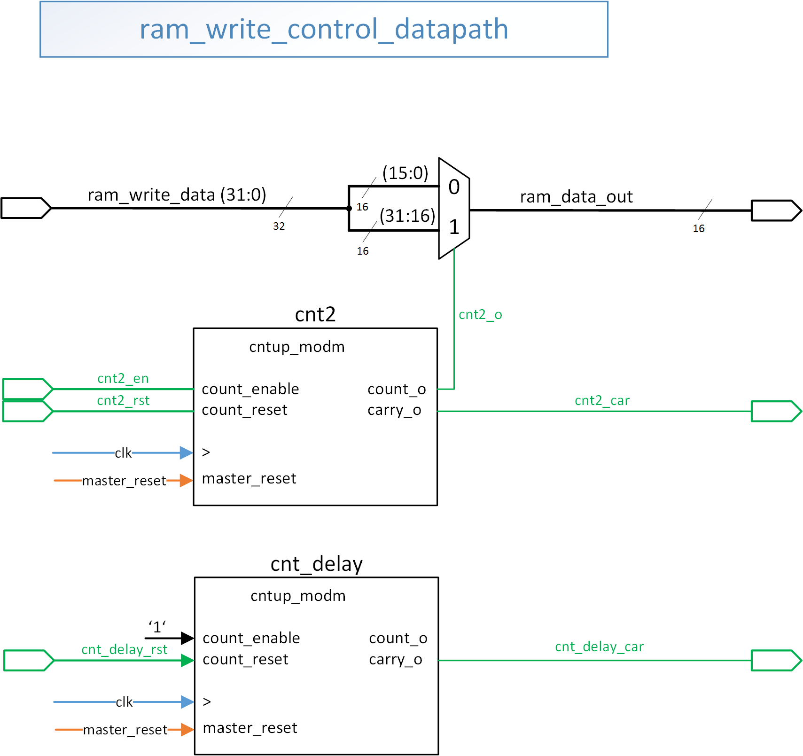

Die Funktion des Datenpfades wurde in einer Testbench simulliert: 

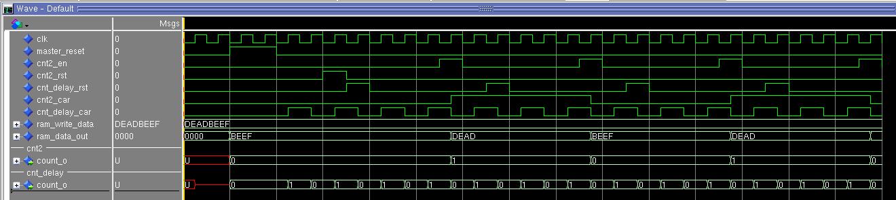

Kontrollpfad

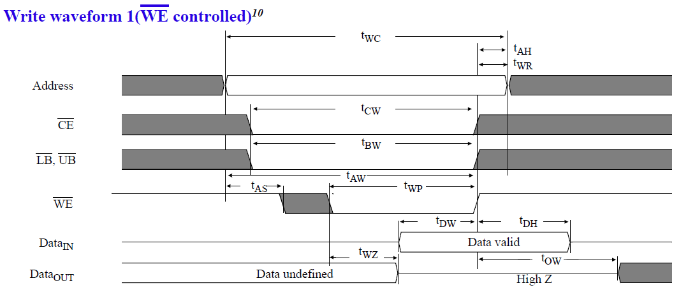

Quelle:  http://www.alliancememory.com/pdf/sram/fa/as7c34098a_v2.1.pdf

Im Datenblatt des RAM-Bausteines gibt es ein Timing-Diagramm, in dem die
Signalfolge abgebildet ist, die zur Speicherung eines 16-Bit Datensatzes nötig
ist. Dieser Ablauf wird durch den Automaten im Kontrollpfad abgebildet. Wenn
über den Eingang store_data signalisiert wird, dass ein Mess-Datensatz zum
Schreiben in den RAM vorhanden ist, wird diese Signalfolge so oft abgearbeitet,
bis der Iterationszähler cnt2 im Datenpfad das Erreichen des Endwertes anzeigt. 

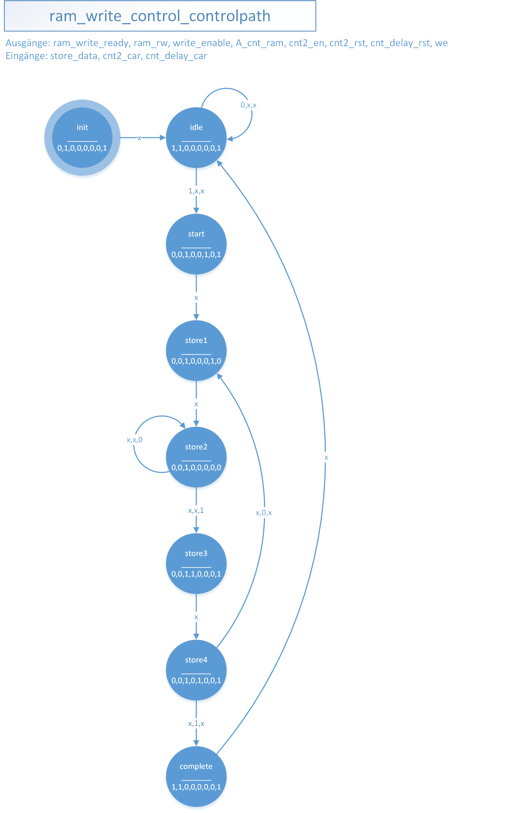

Die Funktion des Moduls ram_write_control wurde in einer Testbench simulliert: 

.. figure:: testbench_ramwritecontrol.png

A_counter
`````````

Eine konkrete Version der generischen Komponente
cntup_modm_maxm_no_overflow_limit. 

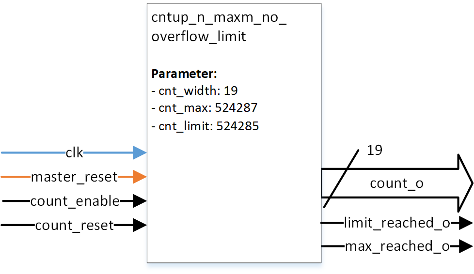

Der Zähler ist 19 Bit breit, da die beiden Speicherbausteine jeweils 18 Bit
haben und über einen Zähler angesteuert werden. Das Höchstwertige Bit des
Zählers wird in ram_control für die Chip-Select-Logik zur Auswahl des aktiven
Speichermoduls verwendet. Der Maximalwert des Zählers ergibt sich aus der
höchsten Adresse, die der Zähler erzeugen kann (219 -1). Da der Messautomat
measure_control noch 32 Bit (entspricht zwei Speicherzellen im RAM) für eine
Endekennung der Messung benötigt, ist der Wert für das Limit um 2 geringer als
der Maximalwert des Zählers. 


ram_tristate_driver
```````````````````

Eine konkrete Version der generischen Komponente generic_tristate_driver. 


Die Breite der Datenleitungen ist 16 Bit, da die Speichermodule in 16-Bit
Speicherzellen organisiert sind. 


measure_control
---------------

.. figure:: measure_control.png

Beschreibung zu measure_control:

Das Modul measure_control übernimmt die Erstellung der Messdatensätze, die dann
von ram_control in den RAM geschrieben werden. Ein Messdatensatz besteht aus
den Signalen der 8 digitalen Messeingänge, einem Zeitstempel und einem
Statusbyte, das signalisiert ob noch weitere Messdatensätze folgen.

Folgende Sub-Module sind enthalten 

measure_control_datapath
````````````````````````

In diesem Modul wird vor dem Speichern einer Messung der Zustand an den
Messeingängen in einem 8-Bit Register gespeichert, damit die Werte für die
Weiterverarbeitung konstant bleiben. 

.. figure:: measure_control_datapath.png

measure_control_controlpath
```````````````````````````

Das Modul wertet die internen und externen Statussignale aus und erzeugt
daraus entsprechende Steuersignale, die sowohl innerhalb als auch außerhalb
von measure_control verwendet werden. 

.. figure:: measure_control_controlpath.png

trigger
```````

.. figure:: trigger.png

Das Modul signalisiert mit der durch freqdiv geteilten Systemfrequenz an
trigger_out eine Signaländerung an den Messeingängen input oder das
Überlaufen des Zeitstempels. 

timestamp_cnt
`````````````

timestamp_cnt_i0

Eine konkrete Version der generischen Komponente timestamp_cnt

.. figure:: timestamp_cnt_measure_control.png

Das Modul zählt mit der von freqdiv geteilten Systemfrequenz. Somit wird zu
jedem Abtastzeitpunkt der Zählerwert internal_timestamp_out, der der
Zeitstempel eines Messdatensatzes wird, inkrementiert.  


freqdiv
```````

.. figure:: freqdiv_measure_control.png

Dieser Zähler bestimmt die Frequenz, in der die digitalen Messeingänge
abgetastet werden sollen. Der Systemtakt wird geteilt durch 16, da diese Zeit
benötigt wird, um einen Messdatensatz in den RAM zu schreiben. 


manager
-------

.. image:: manager_topbox.png

Beschreibung zu manager:

Der Manager regelt das Zusammenspiel der Komponenten mega_control, ram_control
und measure_control. Aus den einzelnen Statussignale werden Steuersignale für
die Komponenten generiert. So bestimmt der manager das Verhalten des
Logikanalysators. 

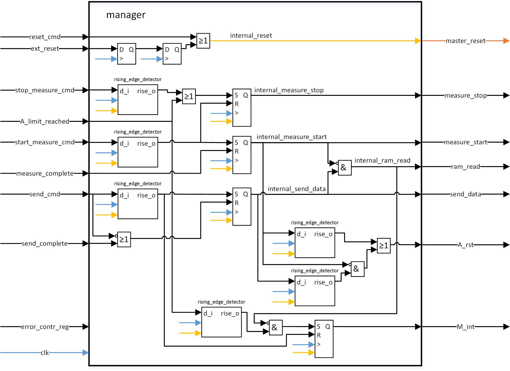

master_reset wird erzeugt durch den mit zwei hintereinander geschalteten D-Flip-Flops synchronisierten externen Reset ext_reset oder durch reset_cmd.

measure_stop wird gesetzt durch A_limit_reached oder eine steigende Flanke an stop_measure_cmd; zurückgesetzt durch eine steigende Flanke von start_measure_cmd.

measure_start wird gesetzt durch eine steigende Flanke von start_measure_cmd und zurückgesetzt durch measure_complete.

send_data wird gesetzt bei einer steigenden Flanke von send_cmd und zurückgesetzt durch send_complete oder nicht send_cmd.

ram_read wird erzeugt aus send_data und nicht measure_start.

A_rst entsteht aus der steigenden Flanke von measure_start oder der Kombination aus steigender Flanke von send_data und nicht measure_start.

M_int wird gesetzt bei steigender Flanke von A_limit_reached und nicht ram_read und zurückgesetzt durch die steigende Flanke von send_cmd.

Der Eingang error_contr_reg wird noch nicht ausgewertet. 


rising_edge_detector
````````````````````

.. image:: rising_edge_detector.png

Der rising_edge_detector gibt am Ausgang rise_o für einen Takt lang einen
high-Pegel aus, wenn am Eingang d_i eine steigende Flanke (Wechsel von
low-Pegel auf high-Pegel) erkannt wird. 


status_register
---------------

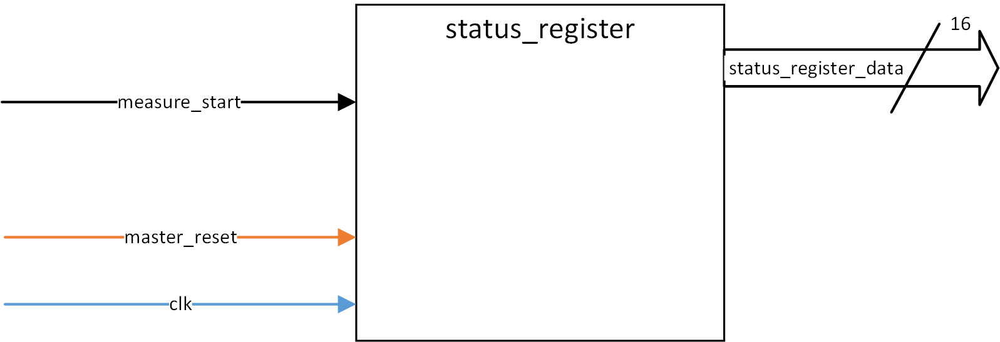

Beschreibung zu status_register:

Im status_register sind einzelne Statussignale (bisher nur measure_start) zu
einem Register zusammengefasst. Der Inhalt des Registers kann von mega_control
an den Mikrocontroller weitergereicht werden. 


Hardware Entwicklungsumgebung
=============================

Altera MAX II EPM240 Core Board (mit EPM240T100C5N).

Um unseren sythetisierten vhdl-Code testen zu können, haben wir am Anfang ein
Entwicklungsboard verwendet, auf dem sich der gleiche CPLD wie auf der
TPLE-Hardware befindet. Auf dieser Platine sind alle Pins des CPLD auf
Stiftleisten herausgeführt. So können erste Tests einfach gemacht werden, da
die Pins leicht zugänglich und von der Funktion beliebig belegbar sind. Über
die JTAG-Schnittstelle kann eine neue Firmware beispielsweise mit einem
USB-Blaster von Altera aufgespielt werden.

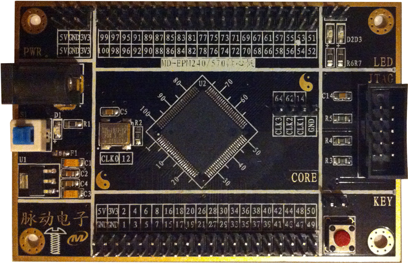

Die Spannungsversorgung erfolgt mit 5 Volt. Ein Spannungsregler erzeugt die
vom CPLD benötigten 3,3 Volt Betriebsspannung. Auf dem Board befindet sich ein
Quarz mit 20 MHz zur Taktversorgung, der fest an Pin 12 mit dem CPLD verbunden
ist sowie zwei LEDs und ein Taster, die jeweils mit einem beliebigen CPLD-Pin,
der auf die Stiftleiste herausgeführt wurde, verbunden werden kann.

Die Pinbelegung der JTAG-Schnittstelle: (Pin 1 ist markiert durch ein kleines
Dreieck auf dem Wannenstecker) 

::

  2 	4 	6 	8 	10
  1 	3 	5 	7 	9 

::

  Pin 	Signal
  1 	TCK
  2 	GND
  3 	TDO
  4 	VCC (Target)
  5 	TMS
  6 	-
  7 	-
  8 	-
  9 	TDI
  10 	GND 


Das Board haben wir gekauft bei:  http://www.canton-electronics.com/altera-max-ii-epm240-core-board-fpga-cpld-development-kits-jtag-usb-blaster-p-375.html


**Altera DE1 Testumgebung**

XXX to do
https://io.informatik.fh-augsburg.de/cgi-bin/trac_Logikanalysator.cgi/wiki/TestumgebungAlterade1


**CPLD Tools Software**

XXX to do
https://io.informatik.fh-augsburg.de/cgi-bin/trac_Logikanalysator.cgi/wiki/CpldToolsSoftware

- Quartus II Web Edition (inkl. Modelsim), v13.0sp1
- Ubuntu 12.04 LTS
  Anleitung von Prof. Beckmann:
  http://www.hs-augsburg.de/~beckmanf/dokuwiki/doku.php?id=ubuntu_virtual_cae_system
- Altera USB Blaster
- qfsm: Automaten für VHDL 
  http://sourceforge.net/projects/qfsm
- http://sourceforge.net/projects/timingeditor/ (nur Windows)
  


Mikrocontroller
===============

- https://io.informatik.fh-augsburg.de/cgi-bin/trac_Logikanalysator.cgi/wiki/LufaUsbStack
- https://io.informatik.fh-augsburg.de/cgi-bin/trac_Logikanalysator.cgi/wiki/MikrocontrollerFirmware
- https://io.informatik.fh-augsburg.de/cgi-bin/trac_Logikanalysator.cgi/wiki/MikrocontrollerFirmwareAtmel
- https://io.informatik.fh-augsburg.de/cgi-bin/trac_Logikanalysator.cgi/wiki/OpenOcdEstickPatch


PC Software
===========

svn co https://io.informatik.fh-augsburg.de/svn/Logikanalysator/


- https://io.informatik.fh-augsburg.de/cgi-bin/trac_Logikanalysator.cgi/wiki/JtagAdapter
- https://io.informatik.fh-augsburg.de/cgi-bin/trac_Logikanalysator.cgi/wiki/JtagJamStapl
- https://io.informatik.fh-augsburg.de/cgi-bin/trac_Logikanalysator.cgi/wiki/AnalyzerData
- https://io.informatik.fh-augsburg.de/cgi-bin/trac_Logikanalysator.cgi/wiki/AnalyzerDataSigrok
- https://io.informatik.fh-augsburg.de/cgi-bin/trac_Logikanalysator.cgi/wiki/AnalyzerDataSigrokHardware
- https://io.informatik.fh-augsburg.de/cgi-bin/trac_Logikanalysator.cgi/wiki/AnalyzerDataSigrokPulseView 


Schluss
=======

- Ausblick https://io.informatik.fh-augsburg.de/cgi-bin/trac_Logikanalysator.cgi/wiki/Ausblick


